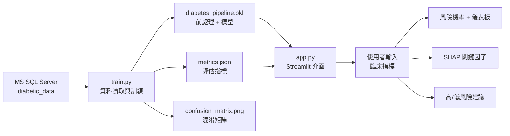

# 糖尿病患 30 天內再入院風險預測系統

## 專案作品集說明書

| 項目 | 內容 |
|------|------|
| **專案類型** | 醫療數據分析 × 機器學習 × 互動式決策支援系統 |
| **應用場景** | 出院前風險評估、個案管理追蹤優先序參考 |
| **技術棧** | Python、SQL Server、LightGBM、XGBoost、SHAP、Streamlit |
| **資料規模** | 101,766 筆住院紀錄 |
| **模型表現** | ROC-AUC **0.681**（v2，較 v1 提升 +0.107） |
| **線上 Demo** | https://diabetes-readmission.streamlit.app |
| **文件版本** | v2.1（2026 年 6 月） |

---

## 一、摘要（Executive Summary）

本專案建置一套**糖尿病患 30 天內再入院風險預測系統**，整合資料庫讀取、機器學習建模、模型評估與 Web 互動介面，提供出院前即時風險機率估算與可解釋的關鍵因子分析。

系統以 MS SQL Server 儲存之臨床資料為基礎，經特徵擴充與多模型比較後，以 **LightGBM** 作為最佳模型，預測患者是否可能於出院後 30 天內再次入院。前端以 Streamlit 提供表單輸入、風險儀表板、分級建議、SHAP 解釋，以及 **What-If 假設分析**（一鍵模擬調藥等介入，對比介入前後風險），使非工程背景的使用者也能理解預測結果並支援出院前討論。

> **一句話描述（申請表/履歷可用）**  
> 建置糖尿病再入院風險預測系統，整合 LightGBM 建模、SHAP 可解釋性分析、What-If 決策模擬與 Streamlit 互動介面；ROC-AUC 0.68，已部署線上 Demo。

---

## 二、研究背景與動機

### 2.1 臨床問題

糖尿病為全球常見的慢性代謝疾病。對住院的糖尿病患者而言，**出院後短期內再次入院（readmission）** 是重要且可量化的結果指標，與下列議題密切相關：

- **患者安全**：再入院常反映出院後病情控制不佳或照護銜接不足
- **醫療資源**：非計畫性再入院增加急診與住院負荷
- **個案管理**：若能在出院前辨識高風險患者，可優先安排追蹤、用藥衛教與回診

### 2.2 為什麼用數據方法？

傳統上，醫護人員依經驗判斷高風險患者，但面對大量出院個案時，難以一致且快速地排序追蹤優先序。  
機器學習可從歷史資料中學習多項指標的組合模式，作為**輔助決策工具**，協助個案管理師或醫師在有限時間內聚焦高風險對象。

### 2.3 專案定位

| 本專案是 | 本專案不是 |
|----------|------------|
| 出院風險輔助參考工具 | 取代醫師診斷的系統 |
| 可解釋的預測原型（Prototype） | 已通過臨床驗證的醫材 |
| 數據科學流程展示作品 | 僅有前端介面的 Demo |

---

## 三、問題定義

### 3.1 預測目標

將 `readmitted` 欄位轉換為二元分類：

| 原始值 | 定義 | 標籤 |
|--------|------|------|
| `<30` | 出院後 30 天內再入院 | **1（高風險）** |
| `>30` 或 `NO` | 未於 30 天內再入院 | **0（低風險）** |

### 3.2 輸入特徵（v2，共 20 項）

**數值特徵（11 項）**

| 特徵 | 說明 |
|------|------|
| `time_in_hospital` | 本次住院天數 |
| `num_lab_procedures` | 實驗室檢查次數 |
| `num_procedures` | 非實驗室處置次數 |
| `num_medications` | 本次住院開立藥物數量 |
| `number_outpatient` | 過去一年門診次數 |
| `number_emergency` | 過去一年急診次數 |
| `number_inpatient` | 過去一年住院次數 |
| `number_diagnoses` | 診斷數量 |
| `admission_type_id` | 入院類型 |
| `discharge_disposition_id` | 出院去向 |
| `admission_source_id` | 入院來源 |

**類別特徵（9 項）**

| 特徵 | 說明 |
|------|------|
| `age` | 年齡區間 |
| `gender` | 性別 |
| `race` | 種族 |
| `max_glu_serum` | 最高血糖檢驗 |
| `A1Cresult` | 糖化血色素 |
| `change` | 糖尿病用藥是否調整 |
| `diabetesMed` | 是否使用糖尿病藥物 |
| `metformin` | Metformin 用藥狀態 |
| `insulin` | Insulin 用藥狀態 |

> v1 基線僅使用 7 項特徵，作為模型迭代前後對照。

### 3.3 類別不平衡

全資料集中，30 天內再入院比例約 **11.16%**，屬於**高度不平衡**資料。  
建模時採分層抽樣（stratified split）與 `class_weight='balanced'`，並以 ROC-AUC 作為主要評估指標，而非僅看 accuracy。

---

## 四、資料說明

### 4.1 資料來源與儲存

- **資料庫**：MS SQL Server
- **資料庫名稱**：`diabetic_data`
- **資料表**：`diabetic_data`
- **總筆數**：101,766 筆

### 4.2 資料流程

```
SQL Server（diabetic_data）
        ↓  SELECT 查詢
   Python（pandas）
        ↓  目標變數定義、類別編碼
   訓練集 / 測試集（8:2，分層抽樣）
        ↓  Pipeline 訓練
   模型檔（diabetes_pipeline.pkl）
        ↓  推論
   Streamlit 互動介面
```

### 4.3 資料使用聲明

- 本專案使用之資料應符合去識別化與研究/學習用途規範
- 對外展示時不應公開可識別個資
- 系統輸出僅供輔助參考，不構成醫療建議

---

## 五、方法論

### 5.1 前處理

採 **scikit-learn Pipeline** 統一訓練與推論流程，避免手動 One-Hot Encoding 造成欄位不一致：

- **數值特徵**：直接 pass-through（Random Forest 不需標準化）
- **類別特徵**：`OneHotEncoder(drop='first')`
- **訓練/推論一致性**：同一 Pipeline 序列化存檔，Web 介面直接載入使用

### 5.2 模型選擇與比較

訓練時同時比較三種演算法，並以測試集 ROC-AUC 選出最佳模型：

| 模型 | ROC-AUC | 備註 |
|------|---------|------|
| v1 基線（Random Forest, 7 特徵） | 0.574 | 初始版本 |
| v2 Random Forest（20 特徵） | 0.652 | 特徵擴充後 |
| v2 XGBoost（20 特徵） | 0.672 | — |
| **v2 LightGBM（20 特徵）** | **0.681** | **最終採用** |

**迭代策略：**

1. 擴充人口統計（年齡、性別、種族）
2. 納入 utilization 指標（門診/急診/住院/診斷數）
3. 加入入院/出院類型與糖尿病用藥狀態
4. 比較三種 tree-based 模型，選 AUC 最高者部署

### 5.3 評估方法

| 指標 | 用途 |
|------|------|
| **ROC-AUC** | 整體區辨能力（不平衡資料下較可靠） |
| **Precision / Recall / F1** | 分別檢視兩類別表現 |
| **Confusion Matrix** | 視覺化誤判型態 |
| **Youden Index 門檻** | 依測試集 ROC 曲線自動計算高風險切點 |

### 5.4 可解釋性（Explainability）

使用 **SHAP（SHapley Additive exPlanations）** 針對單一患者預測，列出貢獻度最高的 3 個特徵，說明該次預測主要受哪些臨床指標影響。  
這比單純顯示機率更符合醫療場域對「可解釋 AI」的期待。

---

## 六、系統架構



### 6.1 專案目錄結構

```
diabetic/
├── app.py                 # Streamlit 推論介面
├── train.py               # 訓練與評估入口
├── run_app.bat            # 一鍵啟動（Windows）
├── src/
│   ├── config.py          # 特徵定義、環境設定
│   ├── data.py            # SQL / CSV 資料讀取
│   ├── pipeline.py        # 前處理、訓練、SHAP 解釋
│   └── what_if.py         # What-If 介入情境定義
├── models/
│   ├── diabetes_pipeline.pkl
│   ├── metrics.json
│   └── reports/confusion_matrix.png
├── docs/
│   └── PORTFOLIO_REPORT.md   # 本文件
├── requirements.txt
├── .env.example
└── README.md
```

### 6.2 系統功能

| 功能模組 | 說明 |
|----------|------|
| 資料輸入表單 | 住院天數、檢查/用藥、過往 utilization、用藥調整、A1C |
| 風險儀表板 | Plotly 指針圖顯示 30 天再入院機率（%） |
| 風險分級 | 依 Youden 門檻判定高/低風險並給追蹤建議 |
| SHAP 解釋 | 列出影響本次預測的前 3 大因子 |
| **What-If 模擬** | 一鍵模擬調藥、Insulin、A1C 改善等介入，同一圖表對比前後風險 |
| 模型摘要 | 展開查看 ROC-AUC、precision、recall 等 |
| 免責聲明 | 明確標示非診斷用途 |

### 6.3 What-If 假設分析模組

**設計目的：** 醫護人員常關心「若現在幫患者調藥，再入院風險可能降多少？」What-If 模組提供**情境模擬（Scenario Analysis）**，在同一圖表上對比「介入前 vs 介入後」的模型預估機率。

**內建快捷情境：**

| 快捷鍵 | 模擬內容 |
|--------|----------|
| 調整糖尿病用藥 | 用藥狀態改為「本次住院有調藥」 |
| 啟用 Insulin | 新增 Insulin 並維持劑量 |
| Metformin 加量 | Metformin 調升劑量 |
| A1C 改善為正常 | 糖化血色素改為正常 |
| 綜合出院優化 | 多項介入同時模擬 |

**輸出：** 雙長條圖 + 風險變化百分點 + 高風險門檻參考線。

**履歷描述（可直接使用）：**

> 設計 What-If 模擬模組，提供醫護人員即時決策輔助，動態評估醫療介入（如調整處方）對降低再入院率的預期成效。

**重要限制：** What-If 為模型敏感度分析，**非因果推論**，不能證明「調藥一定會降風險」，僅供出院前討論參考。

---

## 七、實驗結果

> 以下為 v2 最佳模型（LightGBM）在測試集上的實際評估結果，並與 v1 基線對照。

### 7.1 整體指標

| 指標 | v1 基線 | v2 最佳（LightGBM） |
|------|---------|---------------------|
| 特徵數 | 7 | 20 |
| **ROC-AUC** | **0.574** | **0.681** |
| 提升幅度 | — | **+0.107** |
| Accuracy | 0.769 | 0.660 |
| 建議風險門檻（Youden） | 13.7% | 46.7% |
| 測試集樣本數 | 20,354 | 20,354 |

### 7.2 分類報告（v2 測試集）

| 類別 | Precision | Recall | F1-score | 樣本數 |
|------|-----------|--------|----------|--------|
| 未再入院 | 0.927 | 0.670 | 0.778 | 18,083 |
| **30 天內再入院** | **0.181** | **0.582** | **0.276** | **2,271** |

### 7.3 結果解讀

**改善重點：**

- ROC-AUC 從 0.57 → **0.68**，區辨能力明顯提升
- 再入院類別 **recall 從 0.22 → 0.58**，較能抓出高風險個案
- 這代表系統更適合作為「篩出需要追蹤對象」的輔助工具

**仍須注意：**

- precision 仍偏低（0.18），表示被標為高風險者中仍有较多假陽性
- 尚未做外部驗證（不同醫院/年度資料）
- 仍屬研究原型，非臨床驗證醫材

> 📎 混淆矩陣圖：`models/reports/confusion_matrix.png`  
> 📎 模型比較：`models/model_comparison.json`

---

## 八、系統操作說明

### 8.1 環境需求

- Python 3.10+
- MS SQL Server（訓練時需要）
- 依賴套件見 `requirements.txt`

### 8.2 訓練模型

```bash
pip install -r requirements.txt
copy .env.example .env    # 修改資料庫連線
python train.py
```

### 8.3 啟動 Web 介面

```bash
python -m streamlit run app.py
```

或雙擊 `run_app.bat`，瀏覽器開啟 **http://localhost:8501**

### 8.3 建議展示流程（Demo）

1. **低風險案例**：住院 3 天、過去一年住院 0 次、有調整用藥、A1C 正常  
2. **高風險案例**：住院 10+ 天、過去一年住院 3 次以上、未調整用藥、A1C 未檢測  
3. 對比兩者機率、風險分級與 SHAP 因子差異  
4. 點選 What-If 快捷鍵（如「調整糖尿病用藥」），展示介入前後風險對比  
5. 展開「模型評估摘要」，說明 AUC 與模型限制  

### 8.4 系統截圖（請自行補上）

> 建議截取 4 張圖放入作品集 PDF：

| 編號 | 建議截圖內容 | 檔名建議 |
|------|-------------|----------|
| 圖 1 | 資料輸入表單（完整畫面） | `screenshot_01_input.png` |
| 圖 2 | 風險儀表板 + 高/低風險建議 | `screenshot_02_result.png` |
| 圖 3 | SHAP 關鍵因子 + 模型評估摘要 | `screenshot_03_explain.png` |
| 圖 4 | What-If 調藥前 vs 調藥後對比圖 | `screenshot_04_whatif.png` |

將截圖存至 `docs/images/` 後，可嵌入 PDF 或簡報。

---

## 九、限制與倫理聲明

### 9.1 模型限制

- 目前 ROC-AUC 約 0.68，**不應作為唯一決策依據**
- What-If 為情境模擬，非因果推論，不能取代醫師臨床判斷
- 特徵集仍不完整，未涵蓋所有臨床資訊
- 模型表現依賴訓練資料分布，換醫院或族群可能下降（external validity 未驗證）
- 風險門檻由統計方法（Youden）決定，非臨床共識門檻

### 9.2 使用倫理

- 本系統為**研究/作品集性質之輔助工具**
- 不能取代醫師、個管師或既有臨床流程
- 對外展示時應附免責聲明
- 資料須去識別化，遵守個資與醫療資料相關規範

---

## 十、後續改善計畫

| 優先序 | 方向 | 預期效益 |
|--------|------|----------|
| ★★★ | 外部驗證（不同資料來源） | 確認泛化能力 |
| ★★☆ | 加入 ICD 診斷碼特徵 | 可能再提升 AUC |
| ★★☆ | 匯出 PDF 報告 | 作品集完成度 |
| ★☆☆ | 雲端部署 | 方便遠端 demo |

---

## 十一、個人貢獻與學習成果

透過本專案，完成下列能力展示：

- [x] 從 SQL 資料庫擷取並整理結構化醫療資料
- [x] 定義二元分類目標與類別不平衡處理策略
- [x] 建構可重現的 sklearn Pipeline（訓練/推論一致）
- [x] 使用 ROC-AUC、混淆矩陣、分類報告評估模型
- [x] 導入 SHAP 提供單筆預測解釋
- [x] 開發 Streamlit 互動式前端並完成本機與雲端部署
- [x] 設計 What-If 模組，支援醫療介入情境之前後風險對比
- [x] 撰寫 README、環境設定與操作文件

---

## 十二、三分鐘口頭報告稿（面試/申請可用）

> **開場（30 秒）**  
> 我的作品是「糖尿病患 30 天內再入院風險預測系統」。再入院是醫療品質與資源管理的重要指標，我希望用數據方法，在出院前協助辨識可能需要加強追蹤的患者。

> **方法（60 秒）**  
> 資料來自 SQL Server，共約 10 萬筆。我將 30 天內再入院定義為高風險事件，使用住院 utilization、用藥調整、A1C 等 7 項特徵，以 Random Forest 建模，並用 Pipeline 確保訓練與推論的前處理一致。評估上，我特別關注 ROC-AUC 與再入院類別的 recall，因為資料高度不平衡。

> **系統（45 秒）**  
> 前端用 Streamlit，使用者輸入臨床指標後，可看到風險機率儀表板、分級建議，以及 SHAP 解釋本次預測的關鍵因子。另外我加了 What-If 模組，可一鍵模擬「若調藥、啟用 Insulin」等介入，在同一圖表對比前後風險，支援出院前討論。

> **結果與反思（45 秒）**  
> 第一版只用 7 個特徵，ROC-AUC 約 0.57。後來我擴充到 20 個特徵，並比較 Random Forest、XGBoost 和 LightGBM，最終 LightGBM 達到 0.68，再入院的 recall 也從 0.22 提升到 0.58。這個迭代過程讓我體會到，醫療預測不能只追求 accuracy，更要看 AUC 和 recall。目前 precision 仍偏低，下一步會做外部驗證與診斷碼特徵擴充。

---

## 附錄 A：申請表精簡版（200 字內）

建置糖尿病再入院風險預測系統，整合 LightGBM 建模、SHAP 可解釋性分析、What-If 決策模擬與 Streamlit 互動介面，ROC-AUC 0.68，已部署線上 Demo。What-If 模組可動態評估調藥等介入對再入院風險的預期差異。系統定位為出院個案管理之輔助參考工具，非診斷用途。

---

## 附錄 B：關鍵技術詞彙

| 名詞 | 說明 |
|------|------|
| Readmission | 出院後再次入院 |
| ROC-AUC | 模型區辨正負類的能力，0.5 為隨機，1.0 為完美 |
| Class Imbalance | 正例（再入院）遠少於負例 |
| Pipeline | 將前處理與模型打包，確保訓練/推論一致 |
| SHAP | 以 Shapley 值解釋各特徵對預測的貢獻 |
| Youden Index | 在 ROC 曲線上選擇 sensitivity + specificity − 1 最大的門檻 |

---

*文件結束 — 如需 PDF 版，可將本 Markdown 以 Word、Typora、或 VS Code Markdown PDF 延伸套件匯出。*
